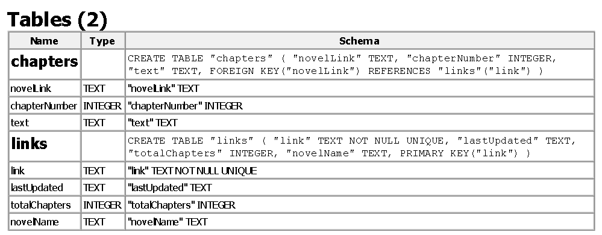

# BetterNovelProject
Like novel project but better

In order to use this script you must have a novels.db sqlite file in the root project folder with the following layout:

In addition you will want to put a the chromedriver in a Driver folder in the root project dir.

Warning: this script uses multiprocessing and launches as many processes as you have cpu cores 
so don't be suprises if you have very high/maxed out cpu usage running this...

Usage:

python writeAllToJson.py http://wixuaworld.com/your-wuxia-world-novel-link

To launch selenium and grab your disired novel and convert its text to audio

python update.py

To launch selenium and update all novels present in the database
